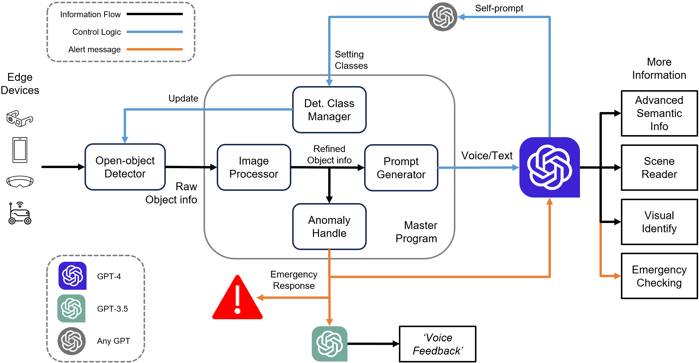
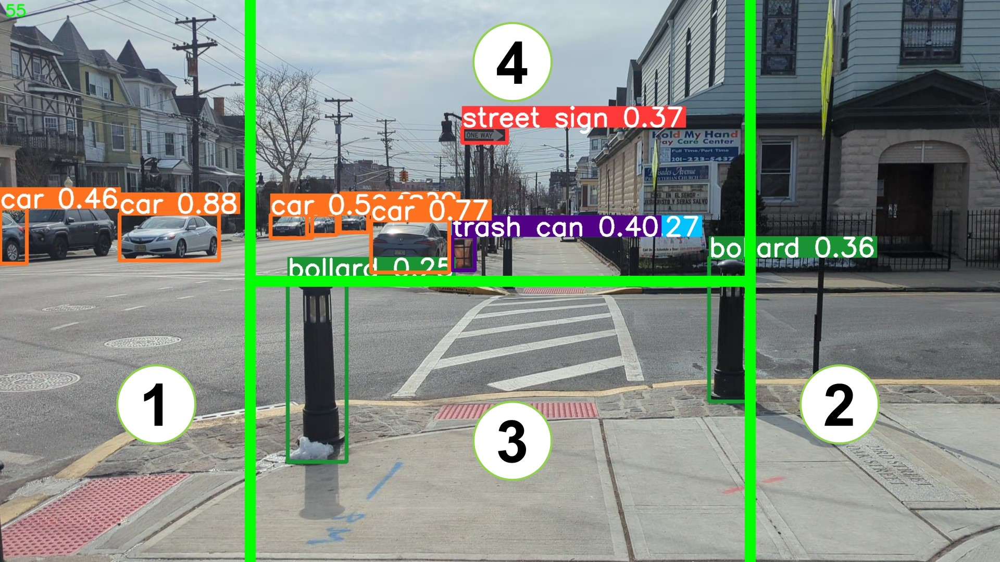
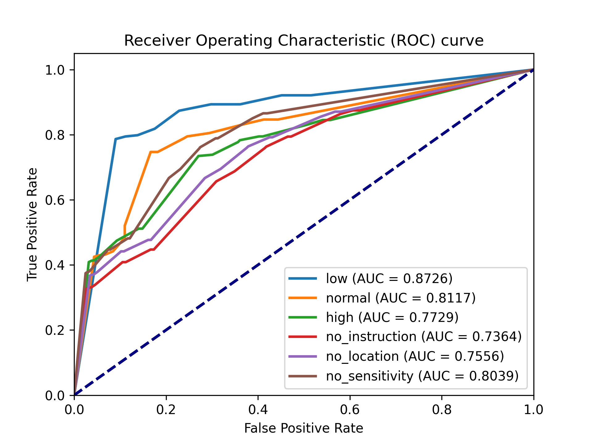
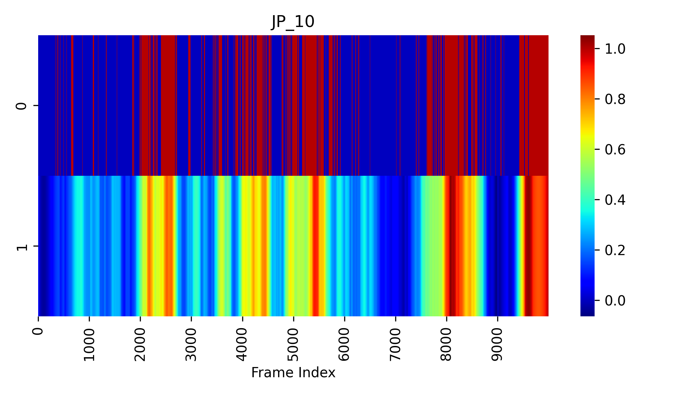

# VisionGPT: LLM-Assisted Real-Time Anomaly Detection for Safe Visual Navigation

## Overview
This project explores the potential of Large Language Models(LLMs) in zero-shot anomaly detection for safe visual navigation. 

<br>

With the assistance of state-of-the-art real-time open-world
object detection model Yolo-World and specialized prompts, the proposed framework can identify anomalies within camera-captured frames that include any possible obstacles, then generate
concise, audio-delivered descriptions emphasizing abnormalities, assist in safe visual navigation
in complex circumstances. 


<div align="center">
    
</div>

Moreover, our proposed framework leverages the advantages of LLMs
and the open-vocabulary object detection model to achieve the dynamic scenario switch, which
allows users to transition smoothly from scene to scene, which addresses the limitation of traditional
visual navigation. 

Furthermore, this project explored the performance contribution of different prompt
components provided the vision for future improvement in visual accessibility and paved the way
for LLMs in video anomaly detection and vision-language understanding.


## Method

### Yolo-World
We apply the latest Yolo-world for the open-world object detection task to adapt the system in any scenario any situation. 

### GPT-3.5
We apply GPT-3.5 for fast response and low cost.


### H-splitter
We implemented an H-splitter to assist object detection and categorize the objects into 3 different types based on the priority. 

<div align="center">
    
</div>

See our another project for more info: <a href="https://github.com/JiayouQin/H-Splitter" target="_blank">H-Splitter</a>


## Experiments
We use Yolo-World with the H-splitter for universal object detection. For any object that falls (a)in Area 3 or (b)in Area 1/2 with 15% of window size, we record the corresponding frame as anomalies. We set this Yolo-World-H setting as the ground truth for the benchmark.

### System Sensitivity
We pre-set the system with 3 different sensitivities to report the emergency: low, normal, and high. We find that the low system sensitivity is good for daily use due to the low false alarm rate.

<div align="center">
    
</div>

### Detection accuracy
We compare the VisionGPT with low system sensitivity with the ground truth to evaluate its performance. We find that VisionGPT has high Accuracy and prefers less False Positive (unnecessary reports).

<div align="center">
    
</div>


## Demonstration


### Acknowledgements:

Please cite our work if you find this project helpful.
```bibtex
@article{wang2024visiongpt,
  title={VisionGPT: LLM-Assisted Real-Time Anomaly Detection for Safe Visual Navigation},
  author={Wang, Hao and Qin, Jiayou and Bastola, Ashish and Chen, Xiwen and Suchanek, John and Gong, Zihao and Razi, Abolfazl},
  journal={arXiv preprint arXiv:2403.12415},
  year={2024}
}
```


